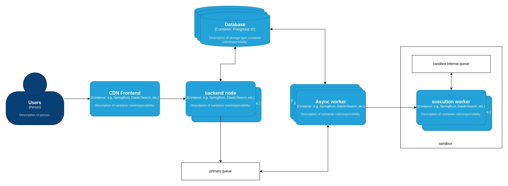

Title: What went wrong on ICPC-Asia Dhaka Regional Preli 2023
Date: 2023-12-24
Category: ICPC
Slug: 2023-icpc-asia-dhaka-regional-preliminary
Modified: 2023-12-26
Tags: icpc, bubt, dhaka-regional, preli, tech
Authors: Mehedi Shafi
Summary: 2023 ICPC Asia Dhaka Regional Preliminary

# Preface on BAPS OJ

BAPS is a voluntary organization that works for improving quality of programmers and programming in Bangladesh. They are also usually responsible for setting problems for ICPC Regional Dhaka site. To host a contest we need a platform that is fast, non-commercial and reliable. Until 2023 CodeMarshal was being used for this purpose. But as a legacy system it had its plethora of issues and outdated stack making it very hard to scale and maintain. That raised the necessity of BAPS to have their own platform fulfilling all check boxes mentioned above. The dream of BAPS OJ started with the main goal being "A fast, reliable and cheap online contest platform where students can contest, practice and universities can take the leverage of it.". The second point is that as BAPS itself is a voluntary organization, BAPS OJ will live up to the same principal and the OJ will be maintained by the community itself. Everyone in the community will own this platform if they wish to.

> [Read the announcement by baps](https://baps-oj.github.io/2023-icpc-asia-dhaka-regional-and-baps.html)

### What is this blog about

On 13th October 23 BAPS OJ had its first large scale contest. It was a disaster for the platform to say the least. Before this we had a mock contest where the load was low. Everything comes into play when we'll dive deep into the details.

First I want to begin by saying how terribly sorry we are even today for the incident. As an ex-contestant I completely agree with the emotion of the community on that day and how horrible every member of the team felt during and after the event.

### So what happened?

On the preli we had 2464 teams across the country. Each team containing 3 members. Raising the active users count to 7500. With judges, coaches, public users the total number of users reached nearly 10000. This is the least important thing we need to remember, as throughout the 4h 30m contest the number of failed request was less than 500 out of nearly a million requests. Let's look into the basic system diagram on how our system works.

> Note that, this is a very top level simplified view.

The frontend and backend was completely redisgned along with database and caches. Only old portion of the system is the code execution sandbox that we took from CodeMarshal due to the complexity and re innovation necessary to build a code sandbox. There are tons of gotcha and cases that a sandbox needs to handle. Which is why we decided it's not worth the pain to do it for the first run and we wanted the contestant to have somewhat familiarity with the behavior of the sandbox.

Now to understand what went wrong we need to dig a bit deeper into the architecture of the sandbox. Don't worry I will not bore you with this portion. Only the input and output of the sandbox. So how the sandbox work is that you give it a code and i/o files and it returns you the output generated by the executed code. But the process is not be synchronous. It's an asynchronous system that uses an internal queue to pick next execution. And we push code to be executed in this queue. There are N worker nodes that can execute a code and stores the output to be fetched by upstream service at a delayed pace. It is not a push mechanism which results in a buffer between the result being ready and displayed to the users.

That's it no more design stuff. Let's actually talk what happened.

We had 24 worker node at the beginning of the contest for our sandbox during the preli. Meaning capability of executing 20 codes at any given point. During the preli the peak number of submission per minute was ~45. Note that this was not always the case. We scaled to 45 workers during first half hour of the contest. By that time peak submission count was somewhere around ~30 per minute. So all good then why the scaling didn't help us?

At the beginning our backend had 24 async workers to communicate and monitor execution of codes with the sandbox. The ratio was somewhat (1:1). I say somewhat because in two async components it's not guaranteed which worker of one system gets assigned to which of the other system. And when at the beginning our async workers were blocked trying to finish execution, we assumed (mistake 1) that we need more workers in our backend. And that's what we did. We scaled up to 104 workers for our backend. Now, note that execution is not the only async task in the backend. There are many others. And hence they got blocked then as well. So scaling up to 104 seemingly helped moving submissions from queued state to running state. As all workers picked one submission and started working on judging it. But there came the second mistake. And it was a big one.

We have 104 workers working in backend to work with 104 submissions at a time while we have 45 codesandbox executing code. For each 104 submissions it was around 700 code executions to finish (taking test cases in consideration). But since the number of workers at backend was more than twice of what sandbox had, it was executing test cases for whichever backend execution reached the sandbox fast. Making some (a lot of) submissions waiting for their all test cases to be executed. This resulted in the RUNNING queue growing over time. This is what we failed to detect during the contest that the RUNNING state submissions were not failed totally rather were partially judged. We should have continued from where it failed execution instead of requeing them.

When we finally understood the root cause it was 1 and half hour after the contest had ended. We deployed several fixes at that time and finished judging with expected speed. And we rejudged all submissions of problem G as requested by judges within an hour and change.

**In short the solution DDoSed our sandbox service.**

What have we done to improve this?

-   We separated worker pool for different job so other tasks like, rank generation and other bots of ours do not block execution of submissions.
-   We ensured that at no point of time auto-scaling increases backend worker count for submission execution is not more than sandbox workers.
-   We ensured that in case a submission fails with our effort it will be automatically retried from last finished test-case with a reserved pool of both backend and execution worker.
-   We enabled extensive monitoring in our sandbox to ensure we understand what it's doing at any given point of time.

The result of the improvement is the onsite. We hope everyone had a fantastic onsite. And once again we're grateful to every contestant and organizers to give us another chance to prove ourselves.

### What's next?

We understand our sandbox is not yet comparable of those what are available presently, we're planning to improve in terms speed, resilience and consistency.
